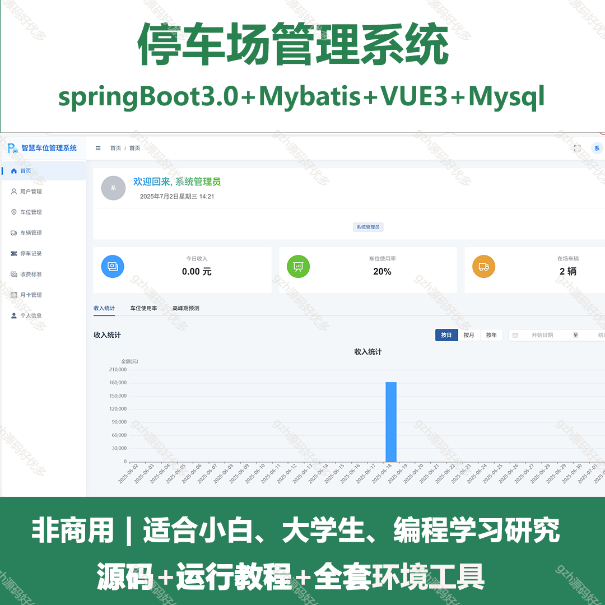
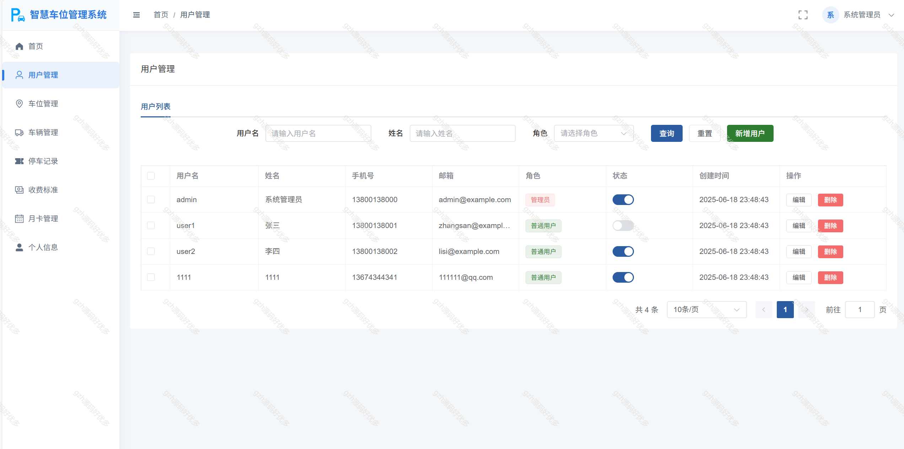
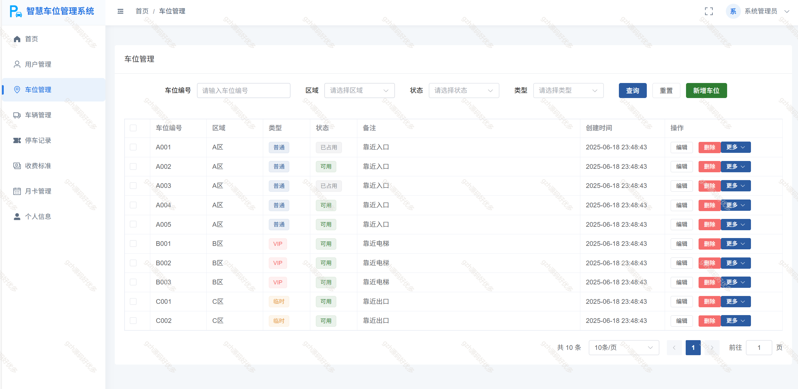
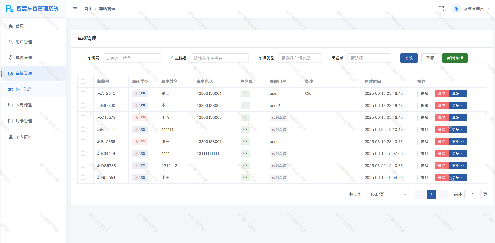
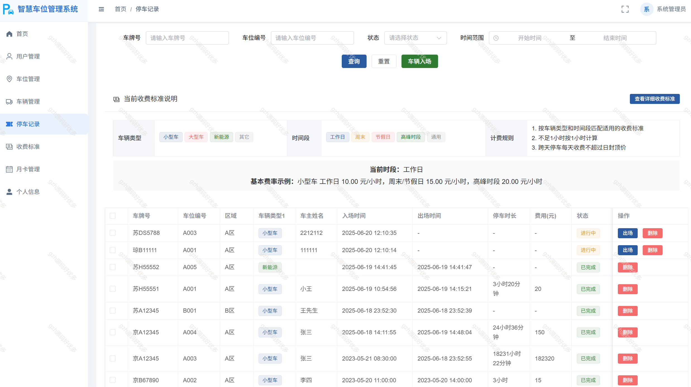
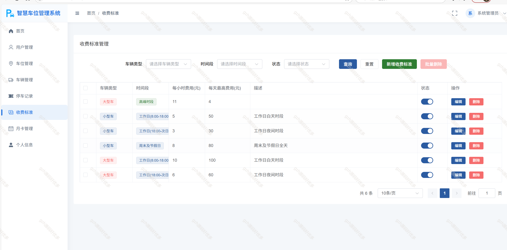
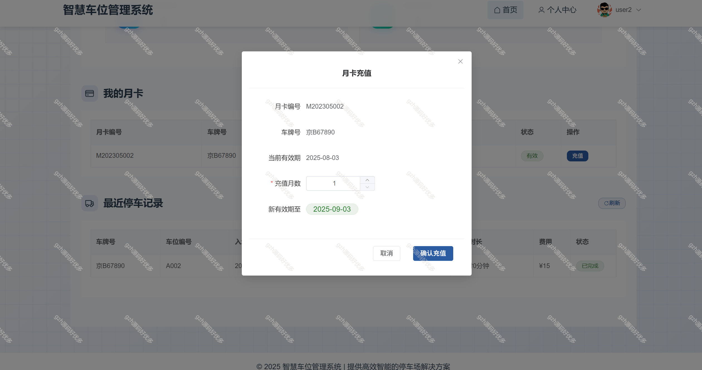

# springbootA521
springbootA521车位停车场管理系统
 
## 查看主页获取源码

### 一、关键词

停车场系统，停车场管理系统

 

### 二、作品包含

源码+数据库+全套环境和工具资源+部署教程

 

### 三、项目技术

前端技术： Vue3 + Element Plus
后端技术：Spring Boot 3 + MyBatis-Plus

  

 

### 四、运行环境（以下版本亲测，其他版本未知，请自测）

开发工具：IDEA/eclipse  + VSCODE

数据库：MySQL8

数据库管理工具：Navicat10以上版本

环境配置软件： JDK17 + Maven3.6.3

前端Nodejs：16

浏览器：谷歌浏览器

 

### 五、项目介绍

项目编号：springbootA521

随着城市化进程的加快和私家车数量的增加，小区、商场、医院等场所的停车管理问题日益突出。传统的人工管理方式效率低下，容易出错，且难以满足现代化管理需求。因此，开发一套车位管理系统，实现车位资源的合理分配和高效管理，具有重要意义。

## 二、功能模块设计

### 2.1 用户管理模块
- 用户登录：系统管理员、普通用户登录系统
- 用户注册：新用户注册账号
- 用户信息管理：查看、修改个人信息
- 密码修改：用户修改登录密码
- 用户权限管理：管理员分配不同用户的权限

### 2.2 车位信息管理模块
- 车位信息录入：添加新车位信息
- 车位信息查询：按区域、状态等条件查询车位
- 车位信息修改：修改车位信息
- 车位状态管理：标记车位为可用、已占用、维修中等状态
- 车位统计分析：统计各区域车位使用情况

### 2.3 车辆信息管理模块
- 车辆信息录入：登记车辆基本信息
- 车辆信息查询：按车牌号、车主等条件查询车辆
- 车辆信息修改：修改车辆信息
- 车辆黑名单管理：标记违规车辆

### 2.4 停车记录管理模块
- 车辆入场登记：记录车辆进入时间、车位分配等信息
- 车辆出场登记：记录车辆离开时间，计算停车费用
- 停车记录查询：按时间、车牌号等条件查询停车记录
- 停车记录统计：统计分析停车时长、频率等数据

### 2.5 收费标准管理模块
- 收费标准设置：设置不同时段、不同类型车辆的收费标准
- 收费标准查询：查询现有收费标准
- 收费标准修改：修改收费标准
- 优惠策略管理：设置各类优惠活动

### 2.6 统计分析模块
- 收入统计：统计每日、每月、每年的停车收入
- 车位使用率分析：分析不同时段车位使用情况
- 高峰期预测：根据历史数据预测停车高峰期

 

### 六、运行截图

